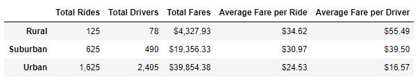
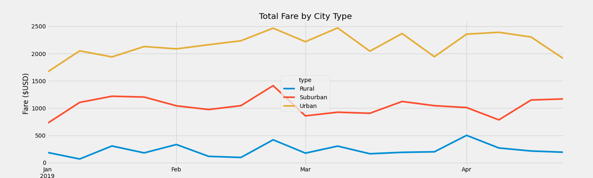

# PyBer Analysis

## Overview of Project

### Purpose

PyBer is a ride-sharing app company that would like to explore the relationships between the type of city and total rides, drivers, and fares. The company wants to improve access to their services at an affordable price for everyone. I will be using Pandas and Matplotlib to visualize the data.

## Results

### City Type Differences

- **Total Rides**: urban cities make up 68.4% of the total rides while suburban cities are 26.3% and rural cities only 5.3%.
- **Total Drivers**: urban cities have 80.9% of the total drivers while suburban cities have 16.5% and rural cities only 2.6%.
- **Total Fares**: urban cities contribute 62.7% of the total fares while suburban cities make 30.5% and rural cities only 6.8%.
- **Average Fare per Ride**: rides cost an average of $24.53 in urban cities but cost 26% more in suburban cities and 41% more in rural cities, on average.
- **Average Fare per Driver**: drivers make an average of $16.57 in urban cities but make 138% more in suburban cities and 235% more in rural cities, on average.
- **Total Weekly Fares**: looking at total fares by week, as seen in the chart below, urban cities consistently make about twice as much as suburban cities and about nine times as much as rural cities.

## Summary

### Business Recommendations

In order to address these disparities among the city types, I recommend that PyBer provides incentives to drivers to start servicing suburban and rural cities more to increase the supply of drivers in these areas. I also recommend they give temporary discounts to riders in suburban and rural cities to increase demand for rides in these areas. Finally, they should use targeted advertising in suburban and rural cities to increase awareness of ride-sharing services to get new riders and drivers.
